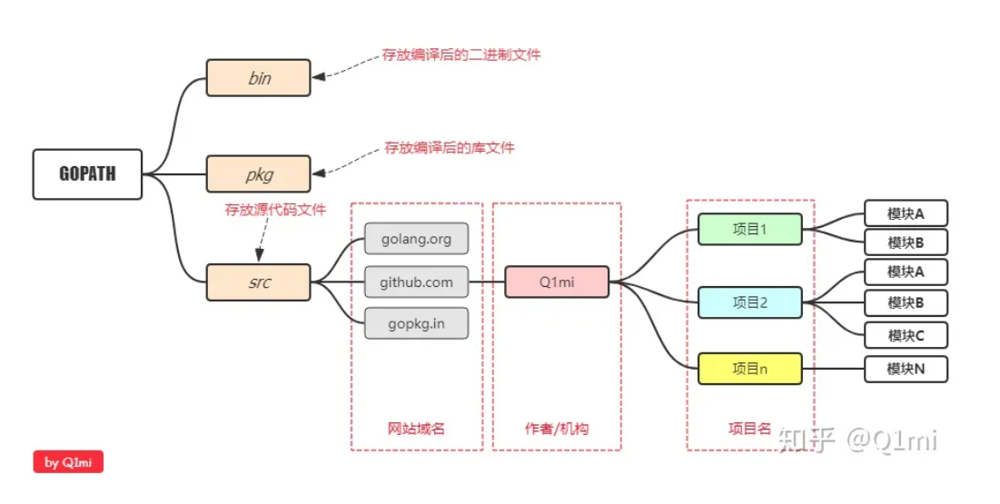

# 步骤
## windows10环境
### 下载安装go安装包
* [Go官网](https://go.dev/dl/)
* Go版本：go1.20.3.windows-amd64.msi
* 安装在C盘，一路next
* 1.8版本之后的go安装包自动配置了环境变量，无需手动配置
  + 自动生成的GOPATH路径在：C:\Users\Zack Chang\go\，其中：
    - bin用于存放编译后生成的可执行文件
    - pkg用于存放编译后生成的归档文件
    - src用于存放源码文件
    - 
  + 参考：[Go语言开发环境搭建](https://zhuanlan.zhihu.com/p/97485217)
  + 在bash输入`go version`验证安装成功
### ide和插件
#### ide
* vscode
* jetbrains的go ide要收费
#### 插件
##### Go by Go Team at Google
